# Authorizing LOCI in Claude Code

This guide walks you through authorizing the **LOCI** MCP server in Claude Code so you can run firmware timing, energy, stack, and memory analysis on your projects.

Authorization is a one-time OAuth handshake. Once connected, LOCI stays connected across sessions until the access token expires (at which point you re-approve with a single click).

---

## Before you begin

You will need:

- **Claude Code** installed and signed in.
- The **LOCI plugin** installed from the Claude Code plugin marketplace.
- A modern browser set as your system default (used for the OAuth consent step).
- An Aurora Labs account — a free tier is available; you can sign up during authorization if you don't have one yet.
- A compiled firmware binary (.elf, .o, or .axf file) — LOCI reads compiled artifacts, not source code.

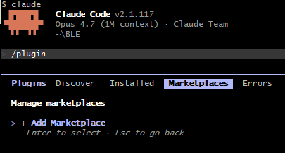

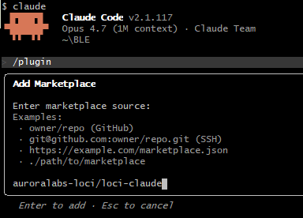

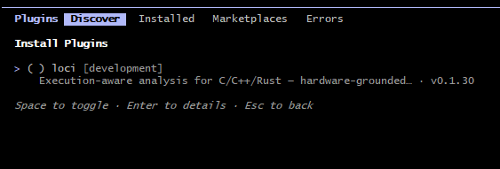

---

## Step 1 — Open the MCP server panel

In your Claude Code session, type:

```
/mcp
```

This opens the MCP server management panel, which lists every MCP server Claude Code knows about and its current authorization status. Right after installation, **loci** appears in the list with an option to install it (i).

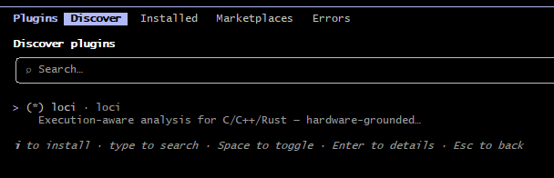

---

## Step 2 — Approve the loci server

Select the **loci** row and enable LOCI plugin. Claude Code opens your default browser and navigates to the Aurora Labs OAuth consent page.

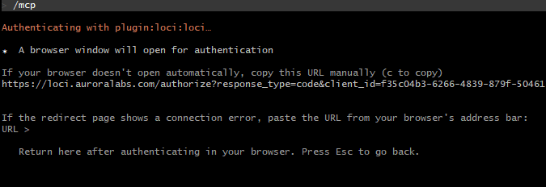

---

## Step 3 — Sign in and grant permissions

In the browser window:

1. Sign in to your Aurora Labs account, or create one if prompted.
2. Click **Sign In**.

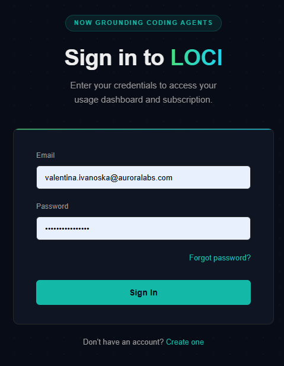

---

## Step 4 — Confirm the connection

After you click **Sign In**, Claude Code receives the OAuth callback automatically. You will see a confirmation message in Claude Code:

```
Authentication successful. Connected to plugin:loci:loci.
```

The browser also shows a short success page — you can close that tab.

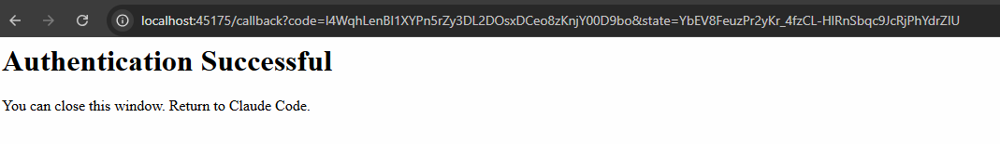

---

## Step 5 — Verify the connection

Run `/mcp` again. The **loci** row now shows a green **Enabled** checkmark.

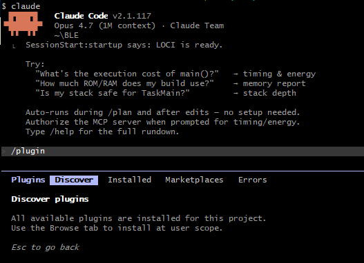

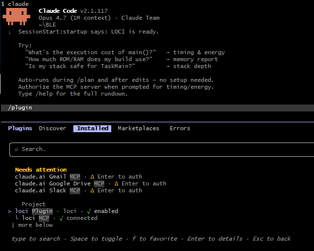

---

## Step 6 — Run LOCI to confirm it works

Invoke the LOCI help skill to verify end-to-end:

```
/help
```

This calls LOCI's usage endpoint and displays your current environment and quota — a green light that everything is wired up.

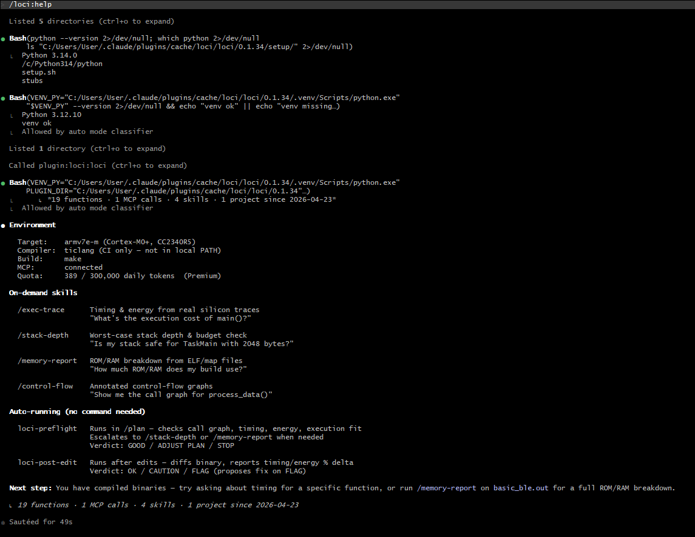

You're done. LOCI is authorized and ready to analyze your firmware.

---

## Re-authorization (when your token expires)

Access tokens expire after a period of inactivity or at a fixed interval. When this happens, the next LOCI call returns:

```
MCP server "plugin:loci:loci" requires re-authorization (token expired)
```

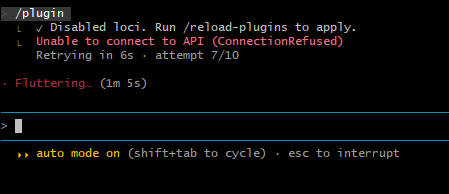

Re-authorization is a single step: run `/mcp` and click **Approve** on the loci row again. Because your browser session with Aurora Labs is usually still active, the consent page is skipped and the handshake completes silently.

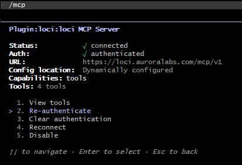

---

## Troubleshooting

| What you see | Likely cause | Fix |
|---|---|---|
| `/mcp` doesn't list `loci` | Plugin registered but not loaded | Restart Claude Code — the plugin registers on startup |
| Browser didn't open after clicking Approve | Default-browser or pop-up block | Check default-browser settings; copy the auth URL from Claude Code's status line and open it manually |
| Browser shows "connection refused" on redirect | Local callback port is blocked | Allow Claude Code through your firewall; try again |
| `Daily token limit reached` in tool output | Free-tier quota consumed for the day | Wait for the reset window shown in the error, or upgrade at [auroralabs.com](https://auroralabs.com) |
| `loci` stays on "Disconnected" after Approve | OAuth callback timed out | Re-run `/mcp` and Approve again; if it persists, restart Claude Code |

---

## Next steps

With LOCI connected, you can run any of its skills from Claude Code:

- `/stack-depth` — worst-case stack depth analysis.
- `/memory-report` — ROM/RAM breakdown from your ELF file.
- `/control-flow` — annotated CFG for a function.
- `/trends` — per-function measurement history on the current branch.
- `/exec-trace` — timing and energy from real silicon traces.

Two skills also run automatically without a slash command:

- **loci-plan** — triggered during `/plan` when you describe new logic.
- **loci-post-edit** — triggered immediately after you edit a C/C++/Rust source file.

See the [LOCI skills reference](../skills/) for details on each skill.

